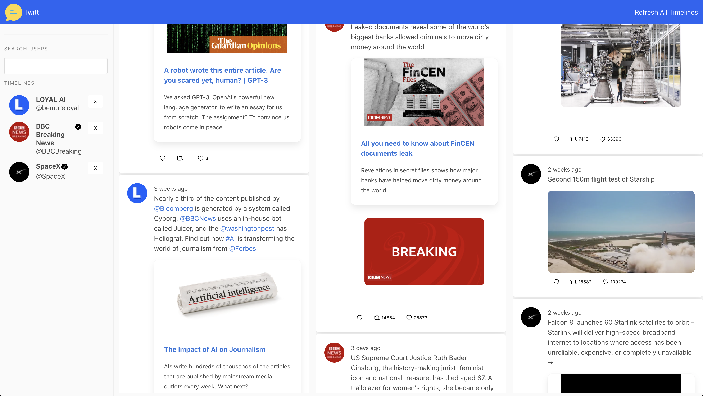
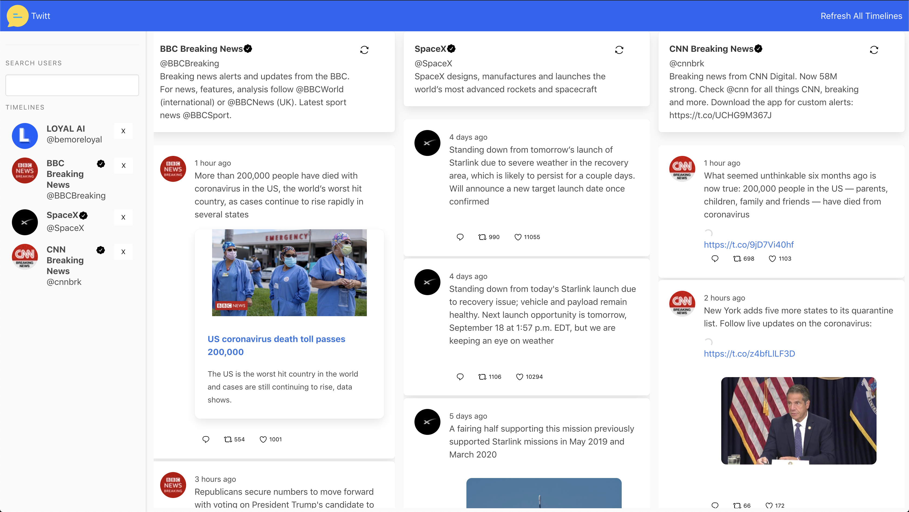
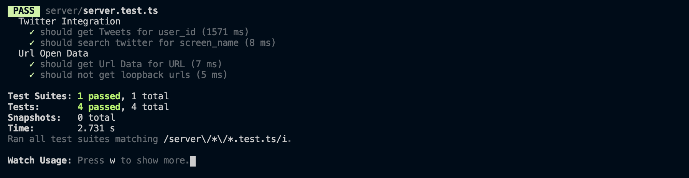

# Twitt

A one-page web application where the user can get multiple twitter user timelines.


Search for user timelines and see suggestions (autocompletion).


Selected timeline displayed on the frontend.


Multiple user timelines support. Add as many user timelines as needed.



Timelines can display images and videos. Additionaly, urls are enriched with metadata so that it displays a url preview. Hashtags and user handles are clickable and redirect the user to Twitter`s relevant timeline.

The user can comment, retweet and like a post. Redirect to twitter for selected intent.



<br/>

# Requirements

The project [requirements](./REQUIREMENTS.md).

# Services

Dockered Redis: Used for caching requests, atomic, multi instance support

# Backend

- twitter -> Twitter Nodejs Client
- express -> Http Server Framework
- jest -> Testing Framework
- supertest -> Http Endpoint Testing
- redis -> Redis Client For Caching
- dotenv -> .env File Loader

## Endpoints

### Timeline for user_id

`GET /api/tweets/:user_id`

30 seconds Redis cache

The application is caching the timeline tweets for a user_id for 30s. Within the 30s, if another user request this timeline, it will be served from cache.


```bash
curl 'http://localhost:3000/api/tweets/911154056302940160' --compressed
```

---

### Search for a user by screen_name

`GET /api/twitter/user/:screen_name`

30 minutes Redis cache

The application is caching the screen_name results for a given search query for 30m. Within the 30m, if another user request this screen_name, it will be served from app cache.

```bash
curl 'http://localhost:3000/api/twitter/user/elonmusk' --compressed
```

---

### Get url metadata (OpenGraph, Twitter Cards)

`GET /api/link/meta?link=_link`

30m Redis Cache

Caching the metadata results for a given url found on a tweet for 30m. 

```bash
curl 'http://localhost:3000/api/link/meta?link=https://google.com' --compressed
```

### Tests Results



<br/>
<br/>
<br/>

# Frontend

This project was bootstrapped with [Create React App](./CRA-README.md).

- react -> Functional UI Framework
- lodash -> Javascript Utilities Library - Used For Debouncing AutoComplete User Search Requests
- timeago.js -> Tiny 2kb Lib to format Time to Time ago
- react-bulma-components -> Bulma UI Framework React Components
- jest -> Default CRA Test Library
- react-app-polyfill -> Adding IE9 and IE11 Polyfills (since we use fetch)

# Run Application in Dev Mode

## Requirements:

- Nodejs 10+
- Docker
- docker-compose

1 - Install Dependencies

```bash
npm install
```

2 - Start the Redis Docker Container

```bash
docker-compose up redis &
```

1 - Create an .env file at root of project with the following structure

```bash
TWITTER_CONSUMER_KEY=____YOUR_TWITTER_CONSUMER_KEY_____
TWITTER_CONSUMER_SECRET=____YOUR_TWITTER_CONSUMER_SECRET_____
TWITTER_ACCESS_TOKEN_KEY=____YOUR_TWITTER_ACCESS_TOKEN_KEY______
TWITTER_ACCESS_TOKEN_SECRET=___YOUR_TWITTER_ACCESS_TOKEN_SECRET____
```

2 - Run The Backend Server

```bash
npm run dev:server
```

3 - Run The Ui Frontend Dev Server

```bash
npm start
```

[UI URL](http://localhost:3000)

```
NOTE: Requests in development mode are proxyed trough the react dev server to the backend server.
```

# Run Application in "Prod" Mode

## Requirements:

- Nodejs 10+
- Docker
- docker-compose

1 - Install Dependencies

```bash
npm install
```

2 - Start the Redis Docker Container

```bash
docker-compose up redis &
```

1 - Create and .env file at root of project with the following structure

```bash
TWITTER_CONSUMER_KEY=____YOUR_TWITTER_CONSUMER_KEY_____
TWITTER_CONSUMER_SECRET=____YOUR_TWITTER_CONSUMER_SECRET_____
TWITTER_ACCESS_TOKEN_KEY=____YOUR_TWITTER_ACCESS_TOKEN_KEY______
TWITTER_ACCESS_TOKEN_SECRET=___YOUR_TWITTER_ACCESS_TOKEN_SECRET____
```

2 - Run The Backend Server

```bash
npm run start:prod
```

[UI URL](http://localhost:9990)

# Run Application in Prod Docker Container Mode

1 - Create and .env file at root of project with the following structure

```bash
TWITTER_CONSUMER_KEY=____YOUR_TWITTER_CONSUMER_KEY_____
TWITTER_CONSUMER_SECRET=____YOUR_TWITTER_CONSUMER_SECRET_____
TWITTER_ACCESS_TOKEN_KEY=____YOUR_TWITTER_ACCESS_TOKEN_KEY______
TWITTER_ACCESS_TOKEN_SECRET=___YOUR_TWITTER_ACCESS_TOKEN_SECRET____
```

2 - Start the Redis Docker Container And Twitt Application

```bash
docker-compose up  &
```

[UI URL](http://localhost:8080)
