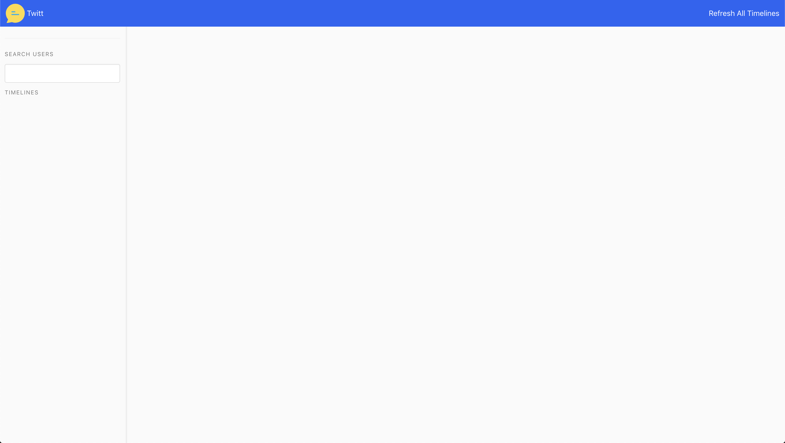
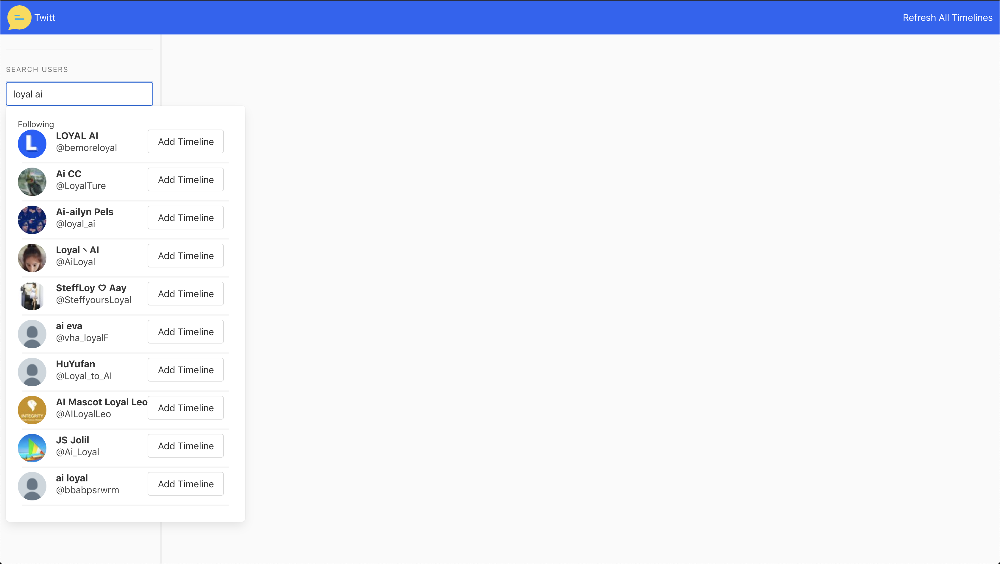
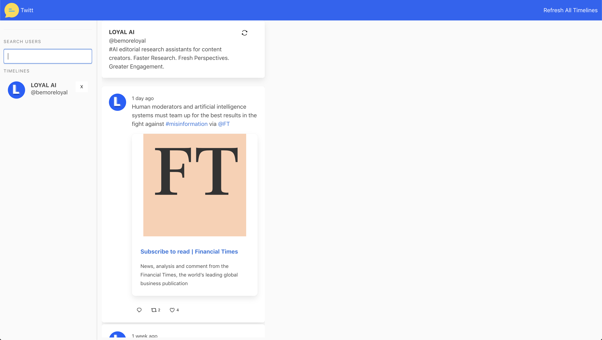
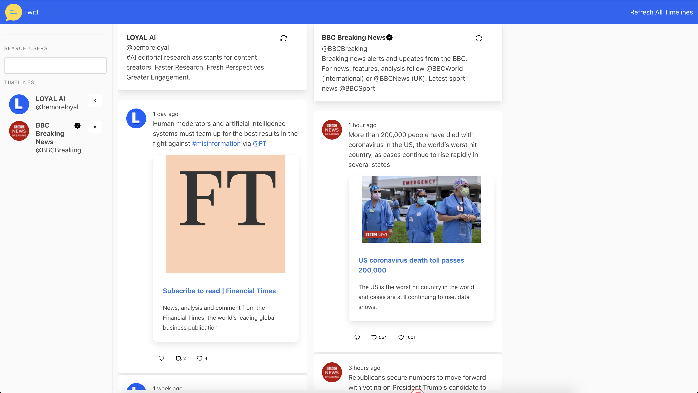

# Twitt 

A application to show twitter timelines with user search and autocompletition








## Dependencies

#### Backend
- twitter -> Twitter Nodejs Client
- express -> Http Server Framework
- jest -> Testing Framework
- supertest -> Http Endpoint Testing
- redis -> Key Value Store - WIP
- dotenv -> .env File Loader

#### Frontend
- react -> Functional UI Framework
- lodash  -> Javascript Utilities Library - Used For Debouncing AutoComplete User Search Requests
- timeago.js -> Tiny 2kb Lib to format Time to Time ago
- react-bulma-components -> Bulma UI Framework React Components
- jest -> Default CRA Test Library
- react-app-polyfill -> Adding IE9 and IE11 Polyfills (since we use fetch)


## Before Running the Application make sure to create a .env file at the ROOT of the project with the following properties:
```env
TWITTER_CONSUMER_KEY=____YOUR_TWITTER_CONSUMER_KEY_____
TWITTER_CONSUMER_SECRET=____YOUR_TWITTER_CONSUMER_SECRET_____
TWITTER_ACCESS_TOKEN_KEY=____YOUR_TWITTER_ACCESS_TOKEN_KEY______
TWITTER_ACCESS_TOKEN_SECRET=___YOUR_TWITTER_ACCESS_TOKEN_SECRET____
```


This project requirements [Requirements](./REQUIREMENTS.md).

This project was bootstrapped with [Create React App](./CRA-README.md).
